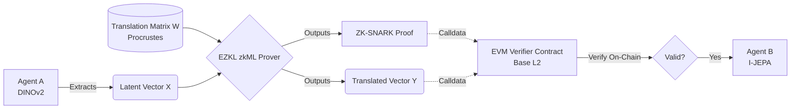

# ZK Latent Bridge PoC

This repository contains a Proof of Concept (PoC) for a Zero-Knowledge Latent Bridge. 

## Context & Inspiration
In a Decentralized AI network, different agents may use entirely different latent spaces. For example, Agent A (using DINOv2, 1024-dim) needs to communicate its latent state to Agent B (using I-JEPA, 1280-dim). To do this without exposing the raw data, Agent A applies a translation matrix $W$ (derived from Procrustes alignment/CKA).

Inspired by the work of [Abdelhamid Bakhta](https://github.com/AbdelStark) on Zero-Knowledge Machine Learning (zkML), this project bridges privacy-preserving cryptographic proofs with inter-model AI collaboration, rooted in the core values of security, trust, and decentralization.

This project demonstrates how to export such a Machine Learning model (simulating a latent vector transformation) to ONNX, generate a Zero-Knowledge proof of its execution using EZKL, and verify that proof trustlessly on-chain via an EVM smart contract (using Foundry) on the Base L2 blockchain.

## Visual Architecture



## Architecture
1. **ML Export (`ml/export_bridge.py`)**: Exports a simple PyTorch model (linear projection from 64 to 128 dimensions) to ONNX format.
2. **ZK Proof Generation (`zk/generate_proof.py`)**: Uses EZKL to compile the circuit, perform the setup, mock the proof, and generate a ZK-SNARK proof (`proof.json`) as well as the Solidity verifier.
3. **EVM Verification (`contracts/`)**: A Foundry project containing a `BridgeEntry.sol` dummy contract that verifies the proof on-chain using the EZKL-generated `LatentBridgeVerifier.sol`.

## Prerequisites
- **Python 3.11+**
- **ML Dependencies** (`pip install -r ml/requirements.txt`)
- **EZKL CLI** v23+ (Ensure `ezkl` is in your PATH. [Installation instructions](https://github.com/zkonduit/ezkl))
- **Foundry** (Ensure `forge` is in your PATH. [Installation instructions](https://getfoundry.sh/))

## Getting Started

### 1. Export the ML Model
Generate the ONNX model and the dummy latent vectors:
```bash
python ml/export_bridge.py
```
*Outputs:* `bridge.onnx`, `input.json`

### 2. Generate the ZK Proof and Verifier
Compile the circuit, run the trusted setup, generate the proof, and create the EVM verifier and calldata:
```bash
python zk/generate_proof.py
```
*Outputs:* `proof.json`, `LatentBridgeVerifier.sol`, `calldata.json`

### 3. Verify On-Chain (Foundry)
Run the unit test which submits the calldata to the `BridgeEntry` smart contract:
```bash
cd contracts
forge test -vvv
```
If the setup is correct, you should see `[PASS] test_zk_proof_verification()`.

## Notes & Known Issues
- **Windows Users**: The `generate_proof.py` script automatically patches the missing `HOME` environment variable issue that can cause `NotPresent` panics in some EZKL versions.
- **Stack Too Deep**: The generated EZKL Solidity verifier can hit EVM stack limits. We resolve this by enabling `via_ir` and using `assembly ("memory-safe")` in the generated verifier. This is pre-configured in `foundry.toml` (`optimizer_runs = 1`).
- **EZKL MatMul Dimension Mismatch**: Pure `MatMul` nodes (e.g. from `nn.Linear(bias=False)`) with 1D vectors can cause dimension mismatch errors in EZKL's `enforce_equality`. The PoC works around this by using `bias=True` (which exports a `Gemm` node) but initializing the bias strictly to `0` to preserve the Procrustes matrix multiplication math.
- **PyTorch ONNX Exporter**: PyTorch 2.X's new Dynamo ONNX exporter produces graphs that EZKL's `tract` parser misinterprets. We strictly enforce the legacy TorchScript exporter (`dynamo=False`) during the ONNX export.
- **EZKL Calibration Bug**: When `input_visibility` is set to `Private`, running `ezkl calibrate-settings` incorrectly re-injects the private input's shape into `model_instance_shapes` in the `settings.json` file. This causes `dimension mismatch` during the mock prover. The `generate_proof.py` script includes a post-calibration patch that manually strips the private input from the instance shapes.

## Acknowledgements & Credits
- **[Abdelhamid Bakhta](https://github.com/AbdelStark)**: Inspired by his work and research in Zero-Knowledge Machine Learning (zkML).
- **EZKL & Foundry**: Powered by [EZKL](https://github.com/zkonduit/ezkl) for zkML proving and [Foundry](https://github.com/foundry-rs/foundry) for EVM verifier smart contract deployment & testing.
